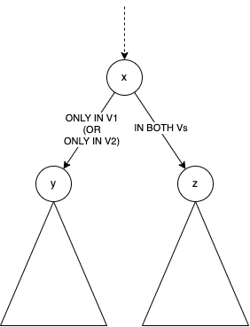

# Project 4: Analyzing software changes and versions

Submission by Marios Tsekitsidis

## My solution: Overview & How-to-run

As far as code, I have modified (1) Graph_Instruction.hpp and (2) Hydrogen.cpp.

- In Graph_Instruction.hpp, I added two public fields (see next section for details).
- In Hydrogen.cpp, I added the class DfsTraverser, which contains the methods paths_added and paths_removed, and right after the creation of the MVICFG I create an object of type DfsTraverser and call the methods paths_added and paths_removed.

As far as tests, I made folders (1) MyTests (for step 5) and (2) RealTests (for step 6), with similar substructure to that of TestPrograms, which are meant to be located in the same directory level as TestPrograms.

### How to run my code & tests

Inside the Hydrogen docker container and inside the "MVICFG" directory, copy & overwrite (1) Graph_Instruction.hpp and (2) Hydrogen.cpp with my files. Copy my test directories & their contents (MyTests/ and RealTests/) preferably also inside the "MVICFG" directory. Then, use Hydrogen per the official instructions.

## My solution: Detailed explanation

For my implementation, I have extended the Graph_Instruction class to accommodate the following additional data (recursion invariant):

- `map<unsigned, unsigned> numActivePathsInVersion`:  the number of maximal acyclic paths rooted (starting) at [self] Graph_Instruction (i.e. graph node), consisting exclusively of edges only in version k (1 or 2 - i.e., get removed or added in V2, respectively) where k is the key in the map,
- `map<unsigned, unsigned> numRetiredPathsInVersion`: the number of maximal acyclic paths rooted at some successor of [self], consisting exclusively of edges only in version k.

With this extension, I have implemented a recursive Depth-First Search algorithm with the following processing, when called on arbitrary node x:

- For each child y of x such that the edge (x,y) is only in version k,

  - `if (y->numActivePathsInVersion[k] == 0)`:

    ​	set `x->numActivePathsInVersion[k] += 1`;

    `else`:
    	set `x->numActivePathsInVersion[k] += y->numActivePathsInVersion[k]`;

  - Let m denote the other version (≠k). Set

    ​	`x->numRetiredPathsInVersion[m] = y->numRetiredPathsInVersion[m]`.

  - Lastly, also set:

    ​	`x->numRetiredPathsInVersion[k] = y->numRetiredPathsInVersion[k]`.

- For each child z of x such that the edge (x, z) is in both versions,
  - Set:
    - `x->numActivePathsInVersion[1] = 0`, and
    - `x->numActivePathsInVersion[2] = 0`.
  - Also set:
    - `x->numRetiredPathsInVersion[1] = y->numActivePathsInVersion[1] + y->numRetiredPathsInVersion[1]`, and
    - `x->numRetiredPathsInVersion[2] = y->numActivePathsInVersion[2] + y->numRetiredPathsInVersion[2]`.

Therefore, when DFS from the root node r of the graph completes:

- paths_added = `r->numActivePathsInVersion[2]+r->numRetiredPathsInVersion[2]`;
- paths_removed = `r->numActivePathsInVersion[1]+r->numRetiredPathsInVersion[1]`;

## Table for step 8

| Version pairs             | Code churn size                                              | MVICFG size                 | NO. of Acyclic paths added | NO. of Acyclic paths removed | time used |
| ------------------------- | ------------------------------------------------------------ | --------------------------- | -------------------------- | ---------------------------- | --------- |
| Test: v1-v2               | Diff file size: 4.0K / 14 lines Diff contents: 2 lines replaced. | \|V\| = 73, \|E\| = 75 | 2                          | 2                            | 37ms      |
| Test: v2-v3               |                                                              |                             |                            |                              |           |
| Your test program: v1-v2  |                                                              |                             |                            |                              |           |
| Your test program: v2-v3  |                                                              |                             |                            |                              |           |
| Real-world program: v1-v2 |                                                              |                             |                            |                              |           |
| Real-world program: v2-v3 |                                                              |                             |                            |                              |           |

